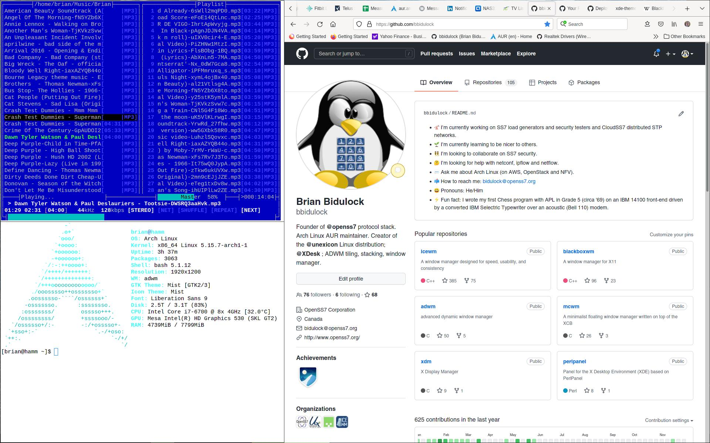
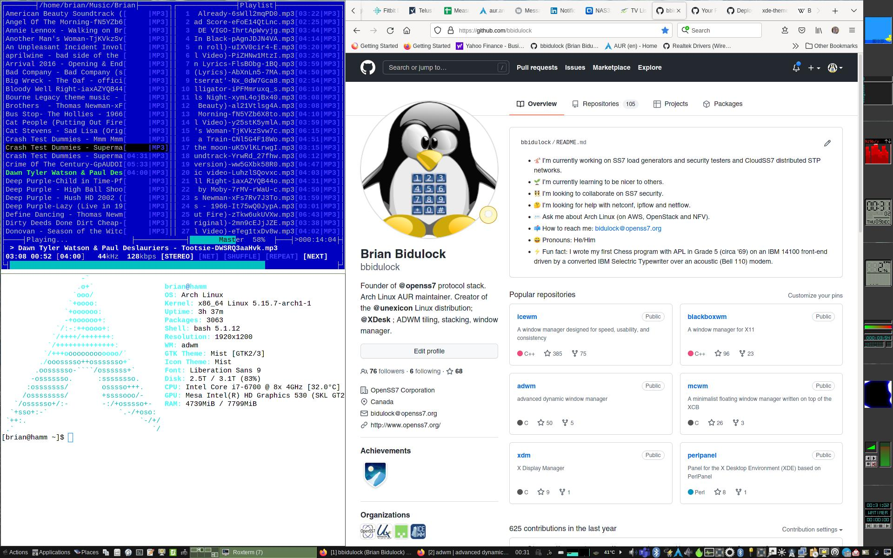
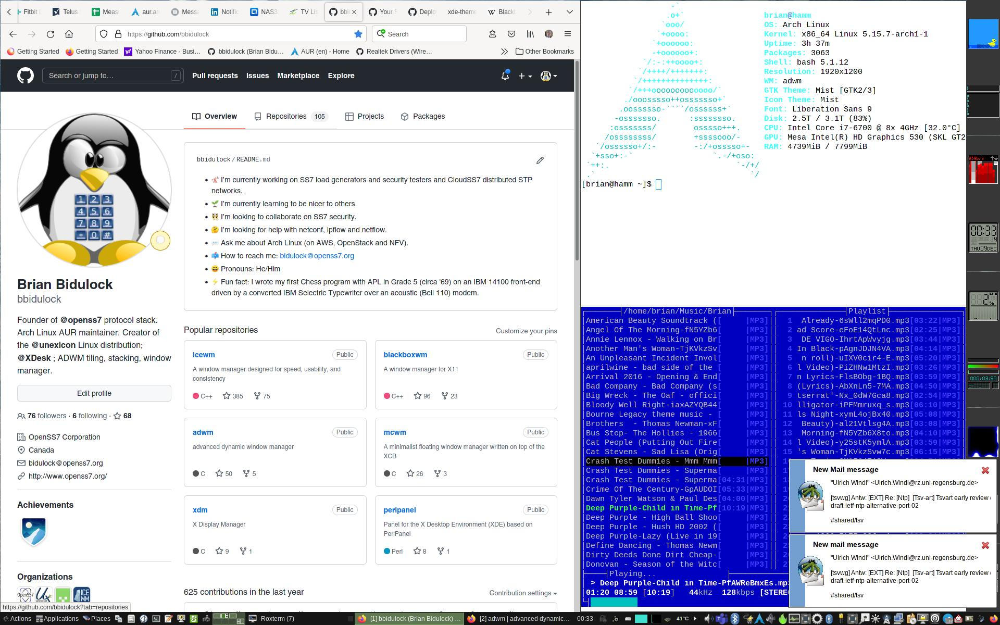
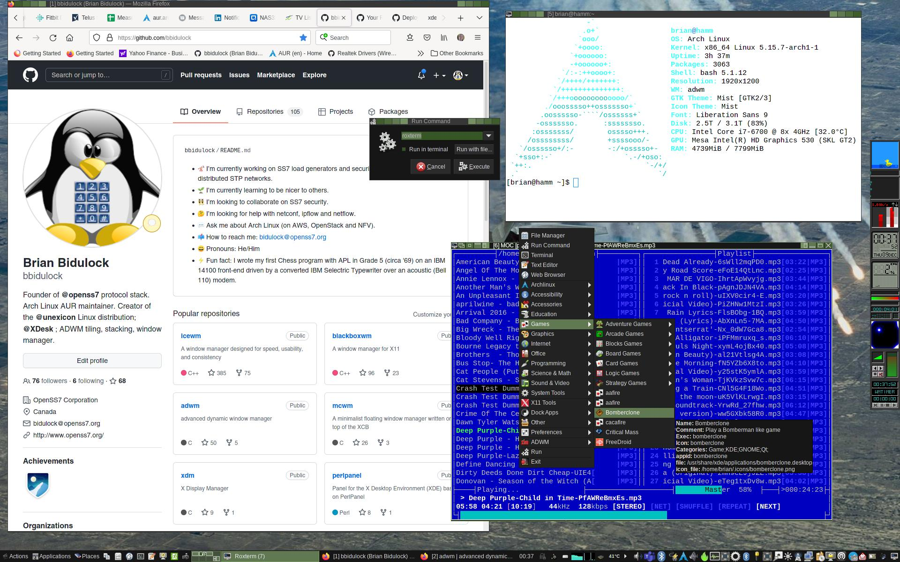
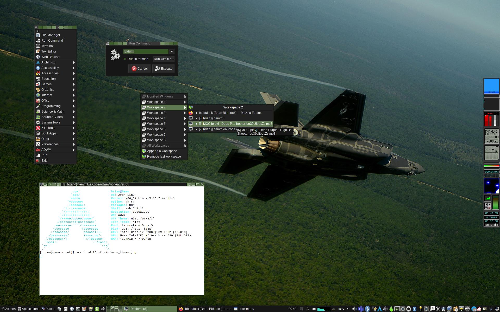
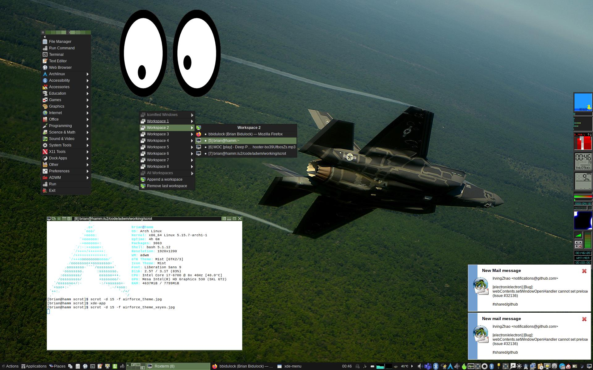

[adwm -- read me first file.  2021-12-09]: #

adwm
===============

Package `adwm-0.7.14.3` was released under GPLv3 license
2021-12-09.

This was originally a fork of Echinus which in turn was a fork of `dwm(1)`,
and borrows concepts from `velox(1)`, `awesome(1)`, `spectrwm(1)` and
`wmii(1)`.  What it includes is a full rewrite with significant updates and
additions resulting in full EWMH (NetwM), WMH (WinWM), MWMH (CDE/Motif),
ICCCM 2.0 compliance and support.

The source for `adwm` is hosted on [GitHub][1].

Release
-------

This is the `adwm-0.7.14.3` package, released 2021-12-09.
This release, and the latest version, can be obtained from [GitHub][1],
using a command such as:

    $> git clone https://github.com/bbidulock/adwm.git

Please see the [RELEASE][3] and [NEWS][4] files for release notes and
history of user visible changes for the current version, and the
[ChangeLog][5] file for a more detailed history of implementation
changes.  The [TODO][6] file lists features not yet implemented and
other outstanding items.

The file [COMPLIANCE][7] lists the current state of EWMH/ICCCM compliance.

Please see the [INSTALL][8] file for installation instructions.

When working from `git(1)`, please use this file.  An abbreviated
installation procedure that works for most applications appears below.

`echinus(1)` and `dwm(1)` were published under the MIT/X Consortium License
that can be found in the file [LICENSE][9].  As over 90% of the source file
lines have been supplied or replaced and the remaining 10% is not subject
to copyright,
this release is published under GPLv3.  Please see the license in the
file [COPYING][10].

Quick Start
-----------

The quickest and easiest way to get `adwm` up and
running is to run the following commands:

    $> git clone https://github.com/bbidulock/adwm.git
    $> cd adwm
    $> ./autogen.sh
    $> ./configure
    $> make
    $> make DESTDIR="$pkgdir" install

This will configure, compile and install `adwm` the
quickest.  For those who like to spend the extra 15 seconds reading
`./configure --help`, some compile time options can be turned on and off
before the build.

For general information on GNU's `./configure`, see the file
[INSTALL][8].

Dependencies
------------

Install the following X Libraries to build and load `adwm`:

- `libxft`
- `libxrandr`
- `libxinerama`
- `libxpm`
- `startup-notification`
- `libxcomposite`
- `libxdamage`
- `libpng`

To support default key and mouse bindings, build and install the
following packages:

- [xdg-launch][11]: for application launching default key bindings
- [xde-ctools][12]: for `xde-run`, `xde-winmenu`, `xde-winlist` and
  `xde-wkspmenu` default bindings
- [xde-menu][13]: for `xde-menu` root menu default bindings
- [xde-session][14]: for `xde-logout` and `xde-xlock` default bindings

To support default key bindings, the following applications must be
installed:

- `uxterm`: to be able to launch a terminal at all
- `roxterm`: for terminal application launching
- `firefox`: for browser application launching
- `pcmanfm`: for file manager application launching
- `gvim`: for editor application launching
- `scrot`: to support screenshot key bindings
- `xbrightness` and `xbacklight` or `acpibacklight`: to support
  brightness keys
- `amixer`: to support audio control keys
- `xrandr`: to support screen rotation key bindings

For a more full-featured desktop environment, build and install the
following packages:

- [xde-styles][17]: for a small, consistent set of styles for ADWM and
  other light-weight window managers
- [xde-panel][15]: for a panel that works well with ADWM
- [xde-applets][16]: for various WindowMaker dock applications and systray
  applets
- [xde-theme][18]: for various desktop themes and theme packs
- [xde-sounds][19]: for base sound themes

Of course for a minimal desktop, lemon-bar and dmenu will suffice
([xde-menu][13] supports a version of dmenu that supports
freedesktop.org desktop files).

Running
-------

Read the manual page after installation:

    $> man adwm

Features
--------

Following are some of the features provided by `adwm(1)` not provided by
similar window managers:

General:

- full NetWM/EWMH, WinWM/WMH (gnome), OSF/Motif and ICCCM 2.0 compliance;
- full support for ICCCM 2.0 client and global modality;
- full RANDR and Xinerama compliance with full support for multi-head
  setups;
- full support for Window Maker dock applications in floating and tiling
  modes;
- window manager based auto-hide for panels and docks (struts);
- three focus models: click-to-focus, sloppy and all-sloppy;
- soon to come: full X11R6 session management;
- very wide array of available key-binding actions;
- key-binding defaults consistent with a wide array of light-weight and
  popular window managers (see [NOTES](NOTES.html)).

Views, Workspaces and Desktops:

- view/tag based workspaces and desktops;
- scroll wheel support for switching desktops;
- key bindings for switching desktops observes EMWH desktop layout.

Floating/stacking mode:

- smart cascading placement algorithm;
- window decorations: title bar, resize grips, wide array of configurable
  buttons;
- themed buttons include hovered, toggled, pressed, focused and unfocused
  pixmaps;
- multiple mouse actions per title bar button based on mouse button
  pressed;
- separate click and click-drag actions for title bar, borders and grips;
- windows can snap to other windows and workspace/monitor boundaries;
- key bindings for moving and resizing windows without using the mouse.
- drop shadowed XFT text in title bars, with separate color selection for
  active and inactive windows;
- dragging of windows between monitor;
- `metacity(1)`-like drag-to-left, -right or -top functions to optimize
  single-desktop operation.

Tiling modes:

- per-monitor tiling layouts for multi-head setups;
- multiple tiling modes including master/stacking, monocle and grid (but,
  no dwindle or centered-master modes, yet);
- adjustable window borders and inter-window margins;
- one pixel open space around dynamic desktop area for clicking on the root
  window in tiled modes;
- ability to drag-and-swap windows in tiling layouts (ala `awesome(1)`,
  `wmii(1)` and `spectrwm(1)`);

Issues
------

Report issues on GitHub [here][2].

Samples
-------

Following are some sample screenshots:

___Figure 1:___ Tiled layout (master right)

___Figure 2:___ Tiled layout (bar exposed)

___Figure 3:___ Tiled layout (master left)

___Figure 4:___ Tiled layout (windows decorated)

___Figure 5:___ Floating layout

___Figure 6:___ Floating layout (root menu)

___Figure 7:___ Floating layout (window menu)

___Figure 8:___ Airforce XDE Theme

___Figure 9:___ Airforce XDE Theme (Xeyes properly rendered)

[1]: https://github.com/bbidulock/adwm
[2]: https://github.com/bbidulock/adwm/issues
[3]: https://github.com/bbidulock/adwm/blob/master/RELEASE
[4]: https://github.com/bbidulock/adwm/blob/master/NEWS
[5]: https://github.com/bbidulock/adwm/blob/master/ChangeLog
[6]: https://github.com/bbidulock/adwm/blob/master/TODO
[7]: https://github.com/bbidulock/adwm/blob/master/COMPLIANCE
[8]: https://github.com/bbidulock/adwm/blob/master/INSTALL
[9]: https://github.com/bbidulock/adwm/blob/master/LICENSE
[10]: https://github.com/bbidulock/adwm/blob/master/COPYING
[11]: https://github.com/bbidulock/xdg-launch
[12]: https://bbidulock.github.io/xde-ctools
[13]: https://github.com/bbidulock/xde-menu
[14]: https://github.com/bbidulock/xde-session
[15]: https://github.com/bbidulock/xde-panel
[16]: https://github.com/bbidulock/xde-applets
[17]: https://github.com/bbidulock/xde-styles
[18]: https://github.com/bbidulock?tab=repositories&q=xde-theme-&type=&language=&sort=name
[19]: https://github.com/bbidulock/xde-sounds

[ vim: set ft=markdown sw=4 tw=72 nocin nosi fo+=tcqlorn spell: ]: #
